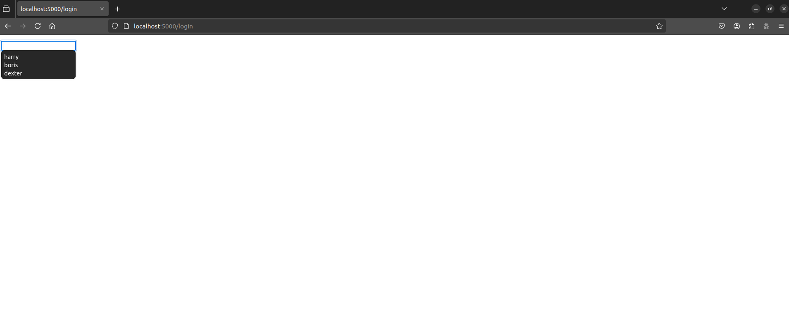
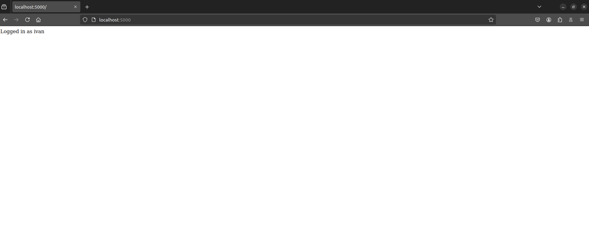
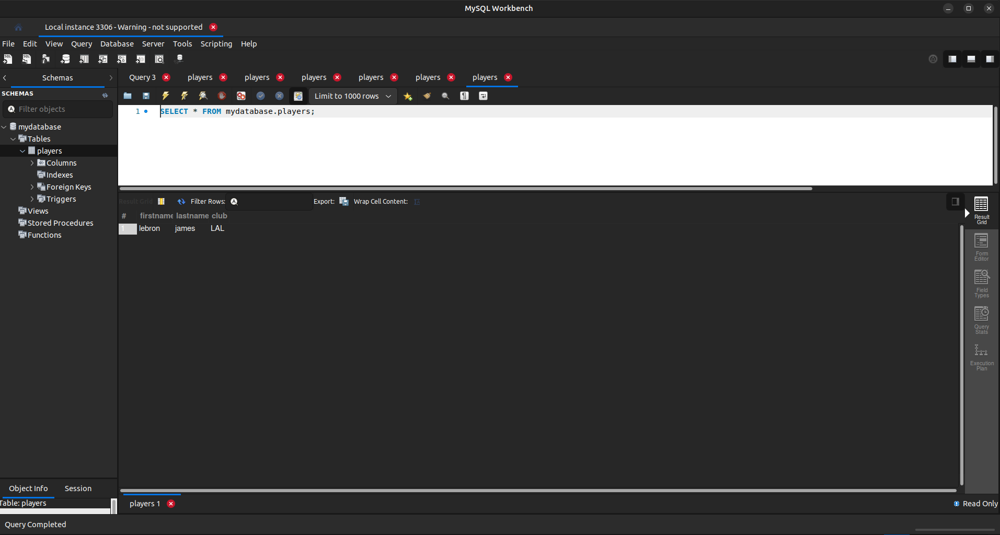

# Incode test

Incode take home test assigment: Webapp with sql (mysql) database and redis

## Table of Contents

- [IRequirements](#Requirements)
- [Installation](#installation)
- [Usage](#usage)
- [CI/CD](#CI/CD)

## Requirements

- docker (not tested on alternatives like Podman od Rancher, but it should work)

## Installation

To install this project, follow these steps:

1. Clone the repository:

2. Navigate to the project directory:
    ```sh
    cd incode/app
    ```

3. Run locally with docker-compose:
    ```sh
    docker compose up --build
    ```
   This will build the flask app image and run it, and also run redis and mysql as dependencies as containers.


1. App is availalbe on `http://localhost:5000`
2. Mysql on `localhost:3307` (port is changed in case there is mysql already running locally)

## Usage

1. App is availalbe on `http://localhost:5000`
2. Mysql on `localhost:3307` (port is changed in case there is mysql already running locally)
3. In the browser navigate to http://localhost:5000

   

4. To test redis usage navigate to http://localhost:5000/login

   
   
   
   After loging in it sould show a successfull login message

   

5. To test interaction with mysql:

    ```
    curl -X POST 'localhost:5000/player?firstname=lebron&lastname=james&club=Lakers'
    ```
    or equivalent request with Postman or some other tool   

    
    Result should be a new row in players table in mysql database

    


## CI/CD

- CI/CD is implemented with github actions (GHA)
- Make changes in the code, commit and push to the remote (main branch)
- After commit/merge to main branch, GHA build the new docker image, pushes it to ECR, updates the helm release on EKS with the new version of the image